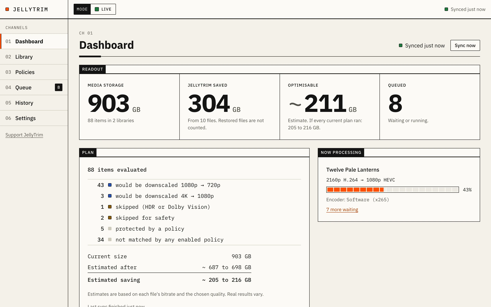
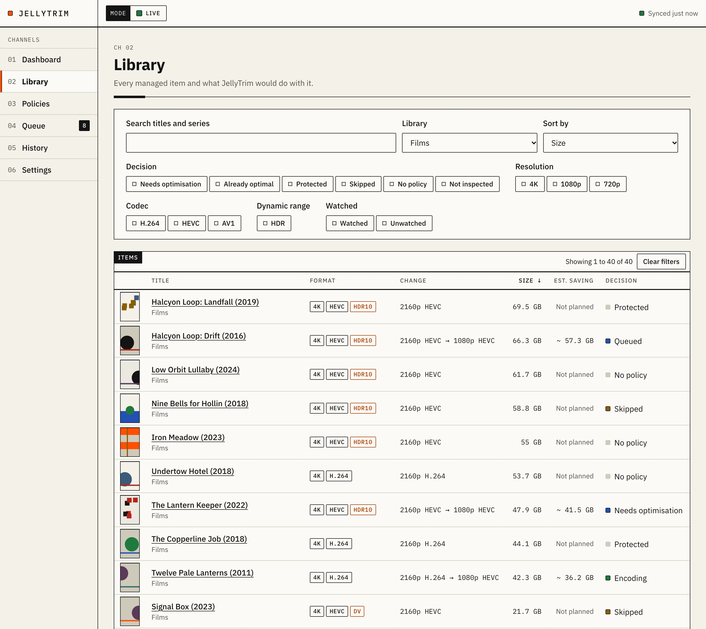
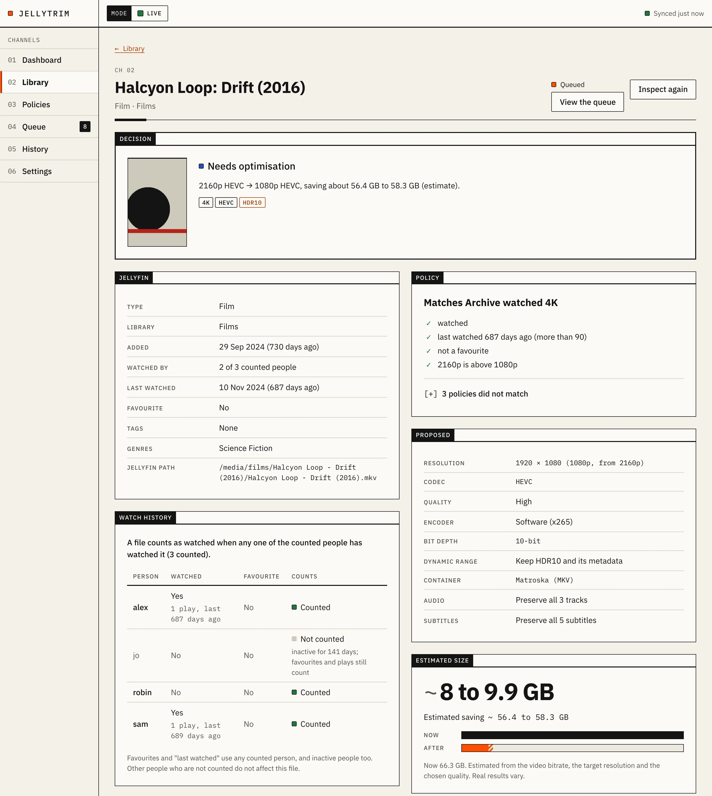
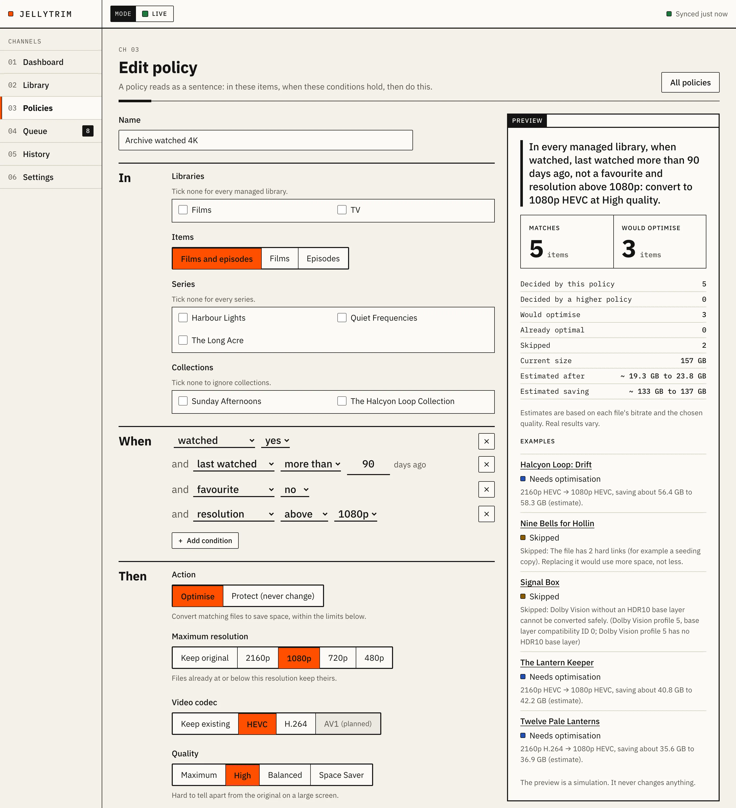
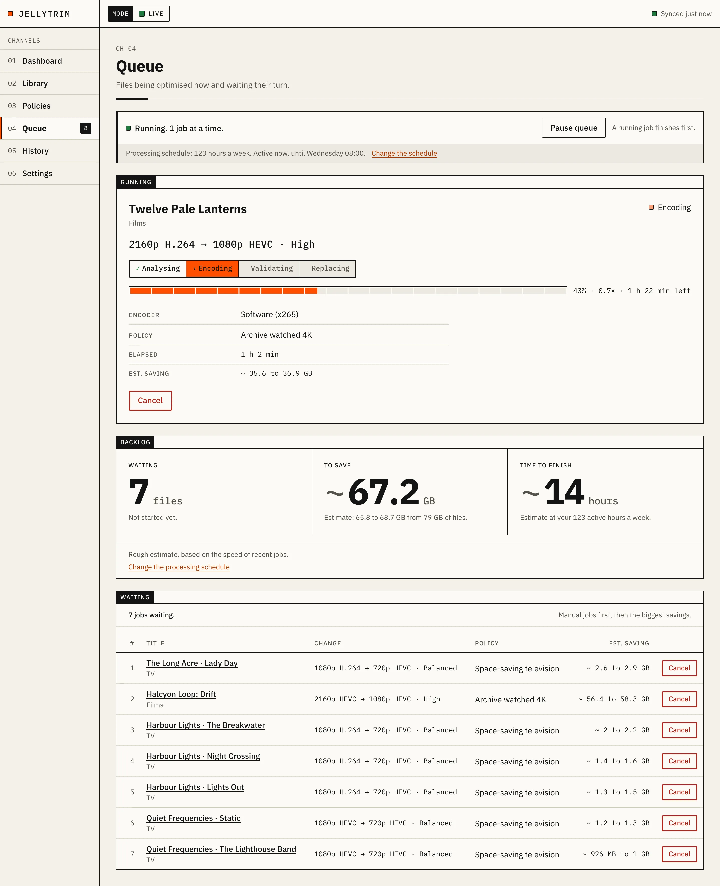
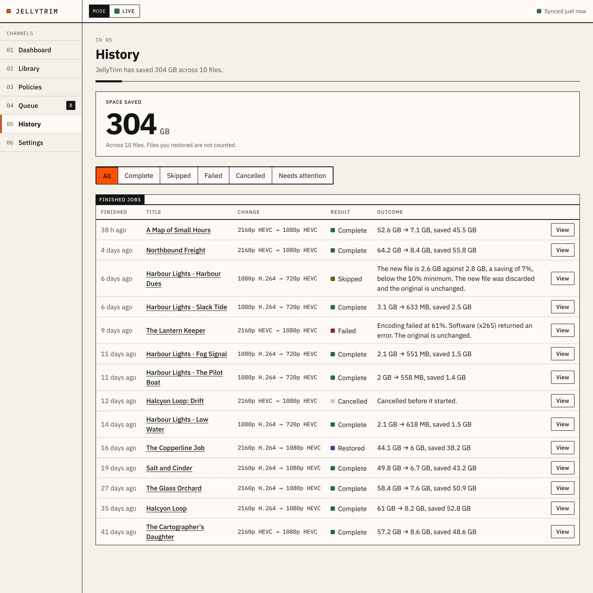
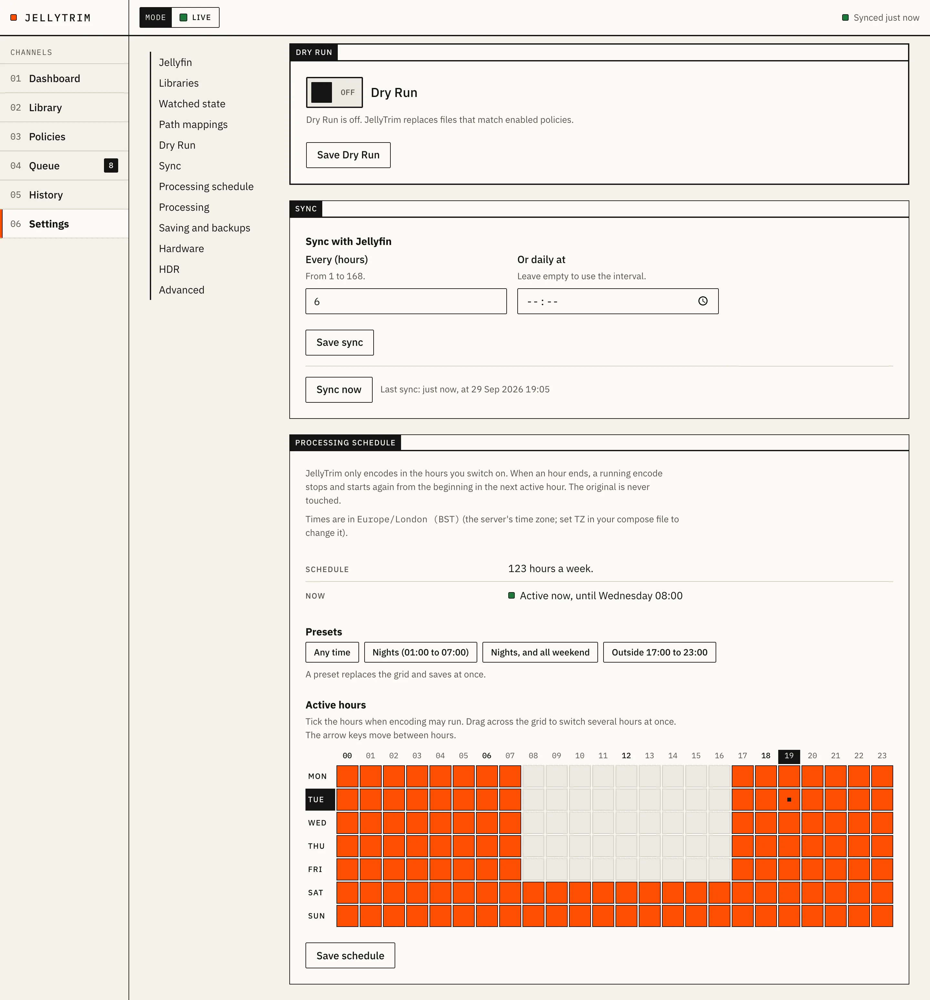
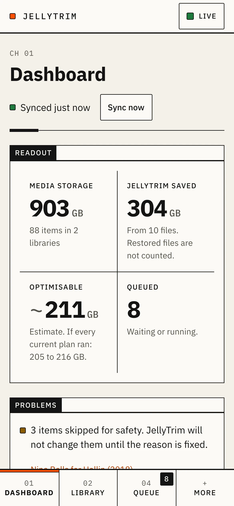

# JellyTrim

**Shrink your Jellyfin library automatically, based on what your household has already watched.**

JellyTrim is a self-hosted media optimiser for [Jellyfin](https://jellyfin.org). It reads Jellyfin's watch history, favourites and libraries, and uses simple rules to decide when a film or episode can be made smaller. Then it re-encodes the file to HEVC (H.265) with ffmpeg, checks the result, and swaps it in without losing a single audio track, subtitle or bit of HDR. Keep a new 4K film exactly as it is; once everyone has watched it and 90 days have passed, turn the 60 GB remux into a 1080p HEVC file a fraction of the size.

It runs as one Docker container next to Jellyfin, with a web interface, no accounts and no telemetry. Dry Run is on until you turn it off, so you see exactly what it would do, and how much space it would save, before it changes anything.

[](https://github.com/freakyturtle/jellytrim/actions/workflows/ci.yml)
[](LICENSE)
[](https://github.com/freakyturtle/jellytrim/pkgs/container/jellytrim)



<sub>Screenshots use the built-in demo mode. Every title, person and number in them is invented.</sub>

## What it does

- **Uses what Jellyfin knows.** Policies can use watched state, last watched date, favourites, date added, library, series, collection, tag, resolution, codec and bitrate.
- **Understands households.** Choose whose watch history counts and how many people must have watched something: any one, a majority, everyone, or a percentage. One person's favourite is enough to protect a file. Accounts nobody uses are left out.
- **Policies read like sentences.** "In Movies, when watched, last watched more than 90 days ago and above 1080p, convert to 1080p HEVC at High quality."
- **Explains every decision.** Each item shows which policy matched and why, condition by condition, and every other policy that also matched.
- **A Dry Run you can trust.** Counts, planned changes and estimated savings for the whole library and for each policy, before anything changes.
- **Keeps everything that matters.** All audio tracks, subtitles, chapters, attachments and metadata are carried over. Watched state and favourites survive, because the file keeps its path.
- **Handles HDR with care.** HDR10 and HLG keep their HDR information. HDR10+ and Dolby Vision are skipped unless a policy allows reducing them to HDR10. JellyTrim never converts HDR to SDR.
- **Never swaps a file mid-film.** It asks Jellyfin what is playing, and waits until nobody is watching before it replaces a file.
- **Works when you choose.** A weekly schedule in hour blocks, so encoding only uses the CPU or GPU overnight, or whenever suits you.
- **Uses your hardware.** Software x265 everywhere, and Intel Quick Sync (QSV) where available. JellyTrim tests each encoder with a real encode instead of trusting what ffmpeg lists.
- **Built for big libraries.** Tested with 100,000 items: a full re-evaluation takes about 3 seconds.

| | |
|---|---|
|  |  |
| **Library.** Every film and episode with its size, codec, resolution and what JellyTrim would do. | **Item.** Why this file would be converted, condition by condition, and who has watched it. |
|  |  |
| **Policies.** Plain-language rules with a live preview of what they match and save. | **Queue.** Progress, speed and time left, with the processing schedule applied. |
|  |  |
| **History.** Every job, with the saving, technical details and a Restore button. | **Settings.** The weekly schedule, backups, watch history rules and encoders. |

<p align="center"></p>

## How it keeps your media safe

JellyTrim's first rule is that a skipped file is always better than a damaged one.

- Dry Run is on until you turn it off.
- The original file is never opened for writing. The new file is written as a hidden file in the same folder.
- The new file must pass every check before it replaces anything: codec, resolution, every audio and subtitle stream, duration, HDR information, and a full decode.
- A file is replaced only if it saves at least 10% (you can change this).
- The original is kept as a hard-linked backup for 7 days, and can be restored from History.
- Every file operation is recorded before it happens, so JellyTrim recovers cleanly after a crash or power cut.
- If a file is unusual (symlinked, hard-linked by a download client, interlaced, rotated, or unclear HDR), JellyTrim skips it and says why.

The details are in [docs/TRANSCODING.md](docs/TRANSCODING.md).

## Quick start

You need Docker with Compose, Jellyfin 10.10 or later, and a Jellyfin API key (in Jellyfin: **Dashboard**, then **API Keys**).

```yaml
services:
  jellytrim:
    image: ghcr.io/freakyturtle/jellytrim:latest
    container_name: jellytrim
    restart: unless-stopped
    user: "1000:1000"               # the user that owns your media files
    ports:
      - "127.0.0.1:8080:8080"       # JellyTrim has no login: see "Security" below
    environment:
      TZ: Europe/London             # used by the processing schedule
    volumes:
      - ./jellytrim-config:/config  # local disk, not a network share
      - /path/to/media:/media       # read-write; ideally the same path Jellyfin uses
    networks:
      - jellyfin                    # a network Jellyfin is also on (see the install guide)

networks:
  jellyfin:
    external: true
```

```sh
docker compose up -d
```

Open `http://localhost:8080`. The setup wizard asks for Jellyfin's address as the container sees it (for example `http://jellyfin:8096`) and the API key, then helps you choose libraries, check path mappings and test your hardware. It finishes with a first Dry Run.

The [install guide](docs/guide/install.md) covers every option: a shared network with Jellyfin, choosing the user, path mapping, Intel Quick Sync, Docker secrets, and notes for Unraid, Synology, TrueNAS and Portainer.

## User guide

1. [Install](docs/guide/install.md) with Docker Compose.
2. [First run](docs/guide/first-run.md): the setup wizard, your first Dry Run, and a cautious first rollout.
3. [Settings](docs/guide/settings.md): every setting and environment variable.
4. [Policies](docs/guide/policies.md): recipes for common goals.
5. [Adding a login with a reverse proxy](docs/guide/reverse-proxy.md): Caddy, nginx and Traefik examples.
6. [Backups and restore](docs/guide/backups-and-restore.md).
7. [Upgrading](docs/guide/upgrading.md).
8. [Troubleshooting and FAQ](docs/guide/troubleshooting.md).

## Is JellyTrim for you?

**A good fit if** you run Jellyfin with a library big enough that storage matters, you keep high-bitrate or 4K files you rarely rewatch, and you want the saving without learning ffmpeg.

**Not a fit if** you use Plex or Emby (JellyTrim needs Jellyfin's API), you want to transcode for playback while streaming (Jellyfin already does that), or you want a general-purpose media processing pipeline.

**Compared with Tdarr, Unmanic and FileFlows.** Those are general-purpose tools for processing whole libraries, configured with plugin stacks or flows, and they work well for that. JellyTrim does one narrower job. It decides from Jellyfin's viewing data *when* each file should get smaller, explains each decision in plain words, and keeps the choice of encoder settings to a few quality levels.

## Security

JellyTrim has **no built-in login**. Anyone who can open its web interface can change policies and turn off Dry Run. Keep it on a private network, or put it behind a reverse proxy that adds authentication. The [reverse proxy guide](docs/guide/reverse-proxy.md) has working examples.

- Requests that change anything are refused if they come from another website, so a malicious page cannot act through your browser.
- The Jellyfin API key stays on the server. It is never shown in the interface or written to logs, and artwork is fetched through JellyTrim.
- Give JellyTrim its own Jellyfin API key, so you can revoke it on its own.

See [SECURITY.md](SECURITY.md) for the threat model and how to report a vulnerability.

## Hardware support

| Encoder | Platforms | Status |
|---|---|---|
| x265 (software HEVC) | amd64, arm64 | Supported and verified |
| Intel Quick Sync (QSV) HEVC | amd64 with `/dev/dri` passed through | Supported; not yet verified on real Intel hardware |
| NVIDIA NVENC | | Planned |
| VAAPI (AMD and Intel) | | Planned |
| AV1 (SVT-AV1 and hardware) | | Planned |

The image includes [jellyfin-ffmpeg](https://github.com/jellyfin/jellyfin-ffmpeg), the same ffmpeg build Jellyfin uses. **Auto** picks the best working encoder for each job, and falls back to x265 when a hardware encoder cannot keep a file's HDR information.

## Status

JellyTrim is feature-complete for its first release but has not reached 1.0, so expect breaking changes. The software encoder (x265) has been verified end to end against Jellyfin 12. Intel Quick Sync has golden-argument tests but has not yet run on real Intel hardware. [docs/MILESTONES.md](docs/MILESTONES.md) shows the detail.

Keep your own backups of media you care about.

## Building from source

You need Go 1.26 or later, [Task](https://taskfile.dev), and ffmpeg with libx265.

```sh
git clone https://github.com/freakyturtle/jellytrim.git
cd jellytrim
task setup
task build        # writes bin/jellytrim
task check        # everything CI runs
task demo         # the demo used for the screenshots, on http://127.0.0.1:8098
```

[CONTRIBUTING.md](CONTRIBUTING.md) covers the development set-up, including a throwaway Jellyfin with generated test media.

Documentation for developers: [product](docs/PRODUCT.md), [architecture](docs/ARCHITECTURE.md), [transcoding](docs/TRANSCODING.md), [policies](docs/POLICIES.md), [UI](docs/UI.md), [development](docs/DEVELOPMENT.md), [testing](docs/TESTING.md), [decision records](docs/adr/) and the [AI agent set-up](docs/agents/README.md).

## Contributions and support

JellyTrim is open source but **not open to contributions**: it is maintained by one person, as a tool they use themselves. Pull requests are not accepted, and there is no issue tracker or support channel. The [user guide](docs/guide/README.md) and [troubleshooting page](docs/guide/troubleshooting.md) are the help that exists. You are welcome to fork it under the MIT licence. Security problems are the exception: report them privately, as [SECURITY.md](SECURITY.md) describes.

## Support JellyTrim

JellyTrim is free, with no paid version and nothing held back. If it has saved you some disk space and you would like to say thanks, you can [leave a tip on Ko-fi](https://ko-fi.com/freakyturtle). It is entirely optional.

The app has the same quiet "Support JellyTrim" link at the bottom of its menu. It is a plain link: JellyTrim never asks for support anywhere else and loads nothing from Ko-fi.

## No telemetry

JellyTrim does not collect usage data, does not call home, and does not need an account. It talks only to your Jellyfin server.

## Licence

MIT. See [LICENSE](LICENSE).

## Acknowledgements

- [Jellyfin](https://jellyfin.org), the free media server JellyTrim works with.
- [FFmpeg](https://ffmpeg.org) and [jellyfin-ffmpeg](https://github.com/jellyfin/jellyfin-ffmpeg), which do the encoding and inspection.
- [templ](https://templ.guide) and [htmx](https://htmx.org), for the web interface.
- [IBM Plex](https://github.com/IBM/plex), the typeface, under the SIL Open Font Licence.
