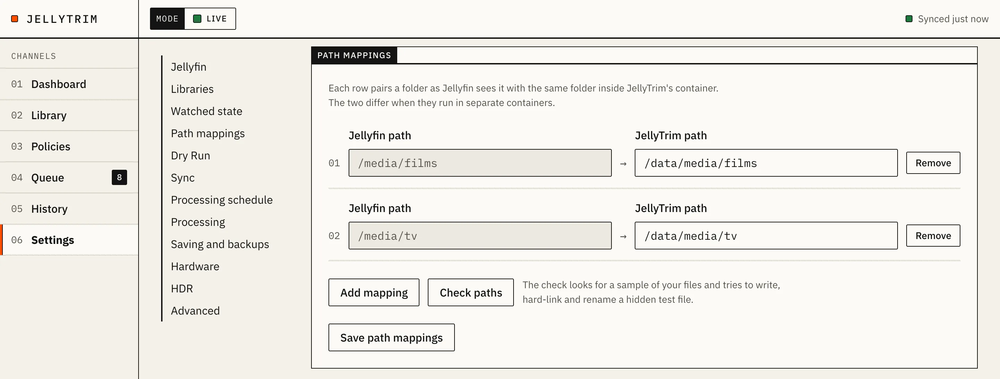

# First run: the setup wizard

The first time you open JellyTrim, it takes you through setup. You can leave at any point and come back later; JellyTrim resumes at the first step it still needs.

## 1. Welcome

An introduction screen. Press **Start setup** to continue to connect Jellyfin.

## 2. Connect Jellyfin

Enter Jellyfin's address and an API key, then test the connection before continuing.

- **Address.** Use the address JellyTrim can reach **from inside its own container**, not `localhost` and not the address you use in your own browser. If Jellyfin is a service called `jellyfin` in the same Compose project (or on a shared Docker network), use `http://jellyfin:8096`. `localhost` inside the JellyTrim container refers to the JellyTrim container itself, not your host machine or Jellyfin's container, so it never works here.
- **API key.** In Jellyfin: **Dashboard, then API Keys, then the plus button**. Give it a name such as "JellyTrim". Paste the generated key into JellyTrim's setup. Use a key made just for JellyTrim, so you can revoke it on its own later.

If you set `JELLYTRIM_JELLYFIN_URL` and `JELLYTRIM_JELLYFIN_API_KEY` (or `_FILE`) as environment variables, and nothing is saved yet, JellyTrim uses them to fill in this step and skips it, going straight to choosing libraries. The fields in Settings are always editable, not read-only: once you save a connection in the UI, Settings is the source of truth, and changing the environment variable afterwards has no effect.

## 3. Choose libraries and whose watch history counts

**Libraries.** Every film and TV library is ticked by default. Untick any JellyTrim should never touch. Only libraries with Movies or Series content matter; JellyTrim ignores other library types.

**Whose watch history counts.** Also on this screen:

- **Everyone, including people added later** (default) or **Only these people:**. The first option counts every enabled Jellyfin user, including ones added later. The second counts only the ones you tick.
- **A file counts as watched when**: Any one, A majority, Everyone, or Custom (a percentage you set). This decides when an item counts as "watched" for policies.
- **Ignore accounts not used for more than N days**: a user with no Jellyfin activity for more than this many days (default 90, 0 counts every account) is left out of that share, so a stale account cannot stop other people's viewing from counting as watched. Their favourites and plays still count, so an absent person's favourite still protects a file.

You can change all of this later in **Settings**. See [Settings](settings.md#watched-state) for the full reference and worked examples.

## 4. Path mappings

Jellyfin and JellyTrim may see the same file at different paths inside their containers. A mapping tells JellyTrim: "the folder Jellyfin calls X is the folder I call Y". The longest matching prefix wins, so you can add a general mapping and a more specific one for an exception.

**If you mounted media at the same path in both containers**, add one mapping where both sides are equal, for example Jellyfin `/media` and JellyTrim `/media`; no translation is needed and this is the simplest setup.

**Worked examples of mismatched paths:**

| Jellyfin sees | JellyTrim sees | Mapping to add |
|---|---|---|
| `/media/movies/Film (2020)/Film.mkv` | `/mnt/media/movies/Film (2020)/Film.mkv` | Jellyfin `/media/movies` → Local `/mnt/media/movies` |
| `/data/tvshows/Show/Season 01/S01E01.mkv` | `/srv/media/tv/Show/Season 01/S01E01.mkv` | Jellyfin `/data/tvshows` → Local `/srv/media/tv` |

The wizard suggests a mapping for each managed library's folders. Press **Check paths** to run the check:

- how many of a sample of Jellyfin's files it can find at the mapped local path;
- whether it can write, hard-link and rename in that folder.



A result of "Found 0 of N files" almost always means the mapping is wrong, or the folder is not mounted into the JellyTrim container at all. "Can write, but hard links are not supported here" means the filesystem does not support hard links (common on some network shares or bind-mounted FUSE filesystems); JellyTrim then makes the backup by renaming the original instead of linking it. That still works, and every step is recorded so a crash can be recovered, but for a moment the original is not at its usual path. See [Troubleshooting](troubleshooting.md#path-mapping-finds-0-files) if the check fails.

## 5. Hardware test

JellyTrim runs a short real test encode for each encoder it can try (software x265, and Intel Quick Sync if `/dev/dri` is passed through), rather than trusting what ffmpeg claims to support. Results show in a table, one row per encoder:

| Encoder | Codec | Device | Result | Notes |
|---|---|---|---|---|
| Intel Quick Sync (HEVC) | hevc | /dev/dri/renderD128 | ✓ Works | Decodes H.264, HEVC in hardware. |
| Software (x265) | hevc | None | ✓ Works | |

A result is **Works**, **Failed** (with a detail in Notes), or **Not available**. Hardware decode is noted as "Decodes H.264, HEVC in hardware."; there is no separate row for decode, and no GPU model name or AV1 row.

If Quick Sync shows as unavailable, check `devices` and `group_add` in your compose file (see [Install](install.md#7-intel-quick-sync-qsv)) and use **Test again**. Software (x265) always works, since it needs no special hardware.

## 6. Defaults

Choose the default quality (Maximum, High, Balanced or Space Saver), the default video codec (HEVC or H.264), and whether JellyTrim should prefer hardware or software encoding by default. These become the starting point for new policies; each policy can still override them.

## 7. Starter policies

JellyTrim offers four starter policies, matching `docs/POLICIES.md`. Only **Protect favourites** is switched on by default:

1. **Protect favourites** (on by default). Never touches anything any counted user has favourited.
2. **Archive watched 4K.** Watched, last watched more than 90 days ago, not a favourite, above 1080p: converts to 1080p HEVC, High quality.
3. **Space-saving television.** Choose which show libraries it applies to (only libraries of type TV Shows are offered). Caps episodes at 720p, HEVC, Balanced quality.
4. **Efficient encoding.** Converts H.264 files to HEVC at the same resolution, High quality.

Tick the ones you want on now. You can add, edit, reorder and switch policies on or off at any time from the **Policies** page; see [Policies](policies.md).

## 8. First Dry Run

Press **Start Dry Run scan**. This marks setup complete and starts a first library sync and evaluation in the background, with **Dry Run on**. The page shows progress, then three figures and a set of count lines:

```
Items checked        238
Would optimise        87   (only enabled policies count)
Could save         ~1.5 TB (estimate. Between 1.4 TB and 1.6 TB if every current plan ran)

 91 already optimal
 87 would be converted H.264 → HEVC
 42 would be downscaled 4K → 1080p
  7 skipped (HDR or Dolby Vision)
 11 not matched by any enabled policy
```

With only **Protect favourites** switched on, "Would optimise" shows 0 and the note reads "No enabled policy would convert anything yet."

**Nothing is changed while Dry Run is on.** JellyTrim only reports what it would do.

## Reading the Dry Run results

1. Go to **Library** and open a few items from different categories: something that "would be converted", something "already optimal", and something "skipped" if you have HDR content.
2. Each item's page shows which policy matched (or would match) and why, line by line, with a tick or cross for every condition:

   ```
   Matches Archive watched 4K
     ✓ watched
     ✓ last watched 143 days ago (more than 90)
     ✓ not a favourite
     ✓ 2160p is above 1080p

   Also matched, not applied
     Efficient encoding (lower in the list, so it does not apply)

   ▸ 1 policy did not match
   ```

   The heading is "Matches <policy>", "Protected by <policy>", "Skipped", or "No enabled policy matches". Policies that also matched but lost to a higher one are listed by name only, under "Also matched, not applied". A collapsed section lists the policies that did not match at all, each with its own tick-or-cross lines.

   Check this matches what you expected. If a film you thought was "watched" shows as not watched, check [whose watch history counts](settings.md#watched-state): a majority or "everyone" rule needs more than one viewing, and inactive accounts may be excluded from the count.
3. For anything skipped, read the reason. Common ones are unclear or unsupported HDR, interlaced or rotated video, or a stream the target container cannot hold. These are always safe defaults, not bugs; see [Troubleshooting](troubleshooting.md#why-was-my-file-skipped).

## Turning Dry Run off

Go to **Settings**, find **Dry Run**, and switch it off. Because turning it off lets JellyTrim start changing files, the Settings page asks for a second confirmation before it takes effect.

**Do this only once you are happy with what a Dry Run reports.** There is no separate "on" confirmation, only an "off" one, since turning Dry Run back on is always safe.

## A cautious first rollout

Rather than switching on every starter policy at once:

1. Enable just **one** policy to start with, ideally scoped to **one** library or a small set of items you do not mind experimenting on.
2. Turn Dry Run off.
3. Watch the first few jobs run in **Queue**: their progress, the encoder used, and how long they take.
4. Check **History** once they finish: the saving achieved, and the technical details if you want to see the exact ffmpeg command used.
5. Spot-check a converted file in Jellyfin: it should still play, with the same audio and subtitle tracks, and (for HDR content) the same HDR appearance.
6. Once you trust the result, enable more policies or widen their scope.

See [Policies](policies.md) for common policy recipes, and [Backups and restore](backups-and-restore.md) if you ever need to undo a change.
